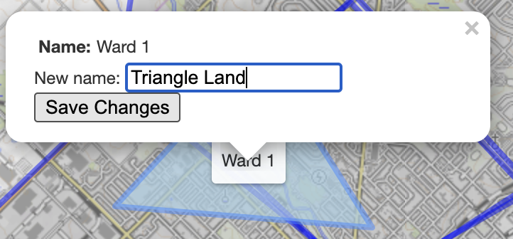
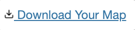

# My Guelph

The City of Guelph is undergoing a process to [revise](https://guelph.ca/city-hall/mayor-and-council/council-composition-and-ward-boundary-review/) the number and boundaries of its wards.

What do you think Guelph's neighbourhoods are?

## How to Use This Map

### Turn maps on/off
You can turn on / off the maps already made by others by selecting this checkbox. 
> 

Currently what's shown on the map is Guelph's existing ward boundaries.

### Drawing wards
Use these buttons to start drawing wards. You can create:
*  **Polygons** - click on the map to begin drawing out the borders of each ward. Complete the shape by clicking on the first point you made. 
> 

*  **Rectangles** - click on the map and drag your cursor to make the rectangle or square bigger. 
*  **Circles** - click on the map and drag your cursor to make the circle bigger. 

If you want to *edit* the shape of a neighbourhood you already drew, use the edit button. 
> 

You can also *delete* things you've drawn. 
> 

### Naming wards
To change the name of a ward, click on it and change the text. 
>  

Be sure to click save. Call the neighbourhoods whatever you want!

### Downloading and sharing your map
Finally, take a screenshot of your map and share it! You can also download your map and...TBD 
> 

